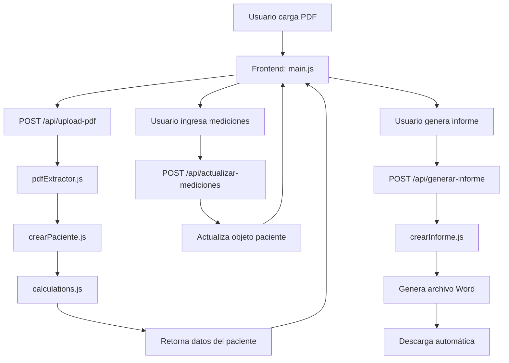

# 🩺 Informatron - Generador de Informes MAPA

## 📋 Descripción del Proyecto

**Informatron** es una aplicación web diseñada para automatizar la generación de informes médicos de **Monitoreo Ambulatorio de Presión Arterial (MAPA)**. El sistema procesa archivos PDF con datos de monitoreo de presión arterial, extrae información relevante del paciente, realiza cálculos médicos automáticos y genera informes profesionales en formato Word (.docx).

### 🎯 Propósito

Facilitar el trabajo de profesionales médicos al automatizar:
- La extracción de datos de reportes MAPA en PDF
- El cálculo de métricas cardiovasculares (patrón Dipper, presión de pulso, clasificación de hipertensión)
- La generación de informes médicos profesionales listos para entregar

---

## ✨ Características Principales

### 🔍 Procesamiento Inteligente de PDF
- Extracción automática de datos del paciente desde archivos PDF
- Reconocimiento de patrones de texto para identificar información clave
- Validación de datos extraídos

### 📊 Cálculos Médicos Automatizados
1. **Patrón Dipper**: Clasificación del ritmo circadiano de presión arterial
   - Dipper: Disminución adecuada (10-20%)
   - Non-Dipper: Sin disminución significativa (<10%)
   - Super Dipper: Disminución exagerada (>20%)

2. **Presión de Pulso**: Cálculo y clasificación según edad
   - Normal: 30-50 mmHg
   - Baja: <30 mmHg
   - Elevada: >50 mmHg

3. **Clasificación de Presión Arterial**:
   - Normal
   - Limítrofe
   - Hipertensión Nivel 1, 2, 3
   - HTA Sistólica Aislada

### 🏥 Soporte Multi-Institución
- Selección de institución al inicio del flujo
- Plantillas personalizadas por institución
- Logos institucionales específicos
- Instituciones soportadas:
  - **Consultorios Médicos**
  - **Vital Norte**

### 📄 Generación de Informes
- Generación automática de documentos Word profesionales
- Uso de plantillas personalizables por institución
- Descarga directa con nombre del paciente

### 🎨 Interfaz de Usuario
- Diseño moderno con tema oscuro
- Flujo de trabajo paso a paso (wizard)
- Validación en tiempo real
- Retroalimentación visual clara

---

## 🏗️ Arquitectura del Proyecto

### Estructura de Directorios

```
Informatron/
├── assets/                        # Recursos estáticos
│   └── logos/                     # Logos de instituciones
│       ├── consultorios_medicos.png
│       └── vital_norte.png
├── back/                          # Backend (Node.js/Express)
│   ├── config/                    # Configuración
│   │   └── config.js              # Configuración de instituciones
│   ├── functions/                 # Lógica de negocio
│   │   ├── pdfExtractor.js       # Extracción de texto de PDF
│   │   ├── crearPaciente.js      # Construcción del objeto paciente
│   │   ├── crearInforme.js       # Generación de informes Word
│   │   └── calculations.js       # Cálculos médicos
│   ├── routes/                    # Rutas de la API
│   │   ├── pdfRoutes.js          # Endpoint de carga de PDF
│   │   ├── medicionesRoutes.js   # Endpoint de actualización de mediciones
│   │   └── informeRoutes.js      # Endpoint de generación de informes
│   ├── templates/                 # Plantillas Word
│   │   ├── PlantillaA.docx       # Plantilla Consultorios Médicos
│   │   └── PlantillaB.docx       # Plantilla Vital Norte
│   ├── output/                    # Archivos generados (temporal)
│   ├── server.js                  # Servidor Express
│   └── package.json               # Dependencias del backend
├── scripts/                       # Frontend JavaScript
│   └── main.js                    # Lógica de la interfaz
├── index.html                     # Página principal
└── styles.css                     # Estilos de la aplicación
```

### Flujo de Datos



---

## 🛠️ Tecnologías Utilizadas

### Backend
- **Node.js**: Entorno de ejecución
- **Express.js**: Framework web
- **Multer**: Manejo de archivos multipart/form-data
- **pdf-parse**: Extracción de texto de PDF
- **docxtemplater**: Generación de documentos Word
- **PizZip**: Manejo de archivos ZIP (formato .docx)
- **CORS**: Habilitación de peticiones cross-origin

### Frontend
- **HTML5**: Estructura
- **CSS3**: Estilos (tema oscuro personalizado)
- **JavaScript (Vanilla)**: Lógica de interfaz
- **Fetch API**: Comunicación con el backend

---

## 📦 Instalación y Configuración

### Requisitos Previos
- Node.js (v14 o superior)
- npm o yarn

### Pasos de Instalación

1. **Clonar el repositorio**
   ```bash
   cd Informatron
   ```

2. **Instalar dependencias del backend**
   ```bash
   cd back
   npm install
   ```

3. **Iniciar el servidor backend**
   ```bash
   # Modo desarrollo (con nodemon)
   npm run dev
   
   # Modo producción
   npm start
   ```
   El servidor se ejecutará en `http://localhost:3000`

4. **Abrir la aplicación frontend**
   - Abrir `index.html` en un navegador web
   - O usar un servidor local como Live Server

---

## 🚀 Uso de la Aplicación

### Flujo de Trabajo

#### Paso 0: Seleccionar Institución
1. Visualizar las tarjetas de instituciones disponibles
2. Hacer clic en la tarjeta de la institución deseada:
   - **Consultorios Médicos**
   - **Vital Norte**
3. La tarjeta seleccionada se resaltará
4. Hacer clic en "Siguiente"

#### Paso 1: Cargar PDF
1. Hacer clic en el botón de selección de archivo
2. Seleccionar un archivo PDF con datos MAPA
3. Hacer clic en "Cargar PDF"
4. Esperar confirmación de carga exitosa
5. Hacer clic en "Siguiente"

#### Paso 2: Ingresar Mediciones
1. Ingresar el número de mediciones diurnas
2. Ingresar el número de mediciones nocturnas
3. Hacer clic en "Actualizar Datos"
4. Esperar confirmación de actualización
5. Hacer clic en "Siguiente"

#### Paso 3: Generar Informe
1. Hacer clic en "Generar y Descargar"
2. El archivo Word se descargará automáticamente
3. El nombre del archivo será: `[NOMBRE_PACIENTE].docx`
4. Hacer clic en "Inicio" para procesar otro paciente

---

## 🔌 API Endpoints

### POST /api/upload-pdf
**Descripción**: Carga y procesa un archivo PDF con datos MAPA

**Request**:
- Content-Type: `multipart/form-data`
- Body: `pdfFile` (archivo PDF)

**Response**:
```json
{
  "success": true,
  "data": {
    "nombre": "APELLIDO NOMBRE",
    "edad": 65,
    "fechaFormateada": "15/03/2024",
    "duracionHoras": 23,
    "todasLasMediasPA": "145/90",
    "mediasPADia": "150/95",
    "mediasPANoche": "130/80",
    "valorCargaPADia": {
      "SYS": "65.5%",
      "DIA": "45.2%"
    },
    "valorCargaPANoche": {
      "SYS": "55.3%",
      "DIA": "35.1%"
    },
    "dipperD": "Ritmo circadiano con disminución adecuada...",
    "dipperC": "Patrón Dipper.",
    "presionPulsoD": "Promedio de la presión de pulso 55 mmHg.",
    "presionPulsoC": "Presión de pulso Elevada (55 mmHg)...",
    "clasificacionPA": "Hipertensión Nivel 1",
    "medicionesDiurnas": null,
    "medicionesNocturnas": null
  },
  "message": "Carga exitosa. Por favor, ingrese las mediciones..."
}
```

### POST /api/actualizar-mediciones
**Descripción**: Actualiza las mediciones diurnas y nocturnas del paciente

**Request**:
```json
{
  "paciente": { /* objeto paciente completo */ },
  "medicionesDiurnas": 45,
  "medicionesNocturnas": 18
}
```

**Response**:
```json
{
  "success": true,
  "data": { /* objeto paciente actualizado */ }
}
```

### POST /api/generar-informe
**Descripción**: Genera y descarga un informe Word con la plantilla de la institución seleccionada

**Request**:
```json
{
  "paciente": { /* objeto paciente completo con mediciones */ },
  "institucion": "consultoriosMedicos" // o "vitalNorte"
}
```

**Response**:
- Content-Type: `application/vnd.openxmlformats-officedocument.wordprocessingml.document`
- Content-Disposition: `attachment; filename="[NOMBRE_PACIENTE].docx"`
- Body: Archivo Word binario

### GET /test
**Descripción**: Endpoint de prueba para verificar que el servidor está funcionando

**Response**: `✅ El servidor está corriendo correctamente.`

---

## 📐 Módulos y Funciones Principales

### 1. pdfExtractor.js
```javascript
leerTextoDelPDF(pdfBuffer)
```
- **Propósito**: Extraer texto completo de un archivo PDF
- **Parámetros**: Buffer del archivo PDF
- **Retorna**: String con el texto extraído

### 2. crearPaciente.js
```javascript
construirPaciente(textoPDF)
```
- **Propósito**: Procesar texto del PDF y construir objeto del paciente
- **Funcionalidades**:
  - Extracción de nombre, edad, fechas
  - Extracción de mediciones de presión arterial
  - Cálculo de métricas cardiovasculares
  - Formateo de datos
- **Retorna**: Objeto paciente completo

### 3. calculations.js

#### calcularPatronDipper(presionDia, presionNoche)
- Calcula el patrón circadiano de presión arterial
- Retorna clasificación: Dipper, Non-Dipper, o Super Dipper

#### calcularPresionPulso(sistolica, diastolica, edad)
- Calcula la presión de pulso (sistólica - diastólica)
- Clasifica según valores normales y edad
- Retorna descripción con valor y clasificación

#### clasificarPresionArterial(sistolica, diastolica)
- Clasifica la presión arterial según guías médicas
- Retorna: Normal, Limítrofe, HTA Nivel 1/2/3, HTA Sistólica Aislada

#### ajustarHoraDuracion(duracion)
- Ajusta horas de duración redondeando según minutos
- Formato entrada: "22H57M"
- Retorna: Número de horas ajustado

#### formatearFecha(fechaOriginal)
- Convierte fecha de "YYYY/MM/DD HH:MM" a "DD/MM/YYYY"
- Retorna: Fecha formateada

### 4. crearInforme.js
```javascript
generarInforme(paciente, institucionId)
```
- **Propósito**: Generar documento Word desde plantilla específica de la institución
- **Parámetros**:
  - `paciente`: Objeto con datos del paciente
  - `institucionId`: ID de la institución (consultoriosMedicos o vitalNorte)
- **Proceso**:
  1. Valida la institución
  2. Obtiene configuración de la institución
  3. Carga plantilla Word correspondiente
  4. Reemplaza variables con datos del paciente
  5. Genera archivo en memoria
  6. Retorna buffer del archivo

### 5. config.js (Backend)
```javascript
obtenerConfiguracionInstitucion(institucionId)
esInstitucionValida(institucionId)
obtenerTodasLasInstituciones()
```
- **Propósito**: Gestionar configuración de instituciones
- **Funcionalidades**:
  - Almacena configuración de cada institución (nombre, plantilla, logo)
  - Valida IDs de instituciones
  - Proporciona acceso a configuraciones

### 6. main.js (Frontend)

#### seleccionarInstitucion(institucionId)
- Gestiona la selección de institución
- Actualiza UI para mostrar selección
- Habilita botón "Siguiente"

#### subirPDF()
- Envía archivo PDF al backend
- Almacena datos del paciente
- Habilita botón "Siguiente"

#### actualizarMediciones()
- Envía mediciones al backend
- Actualiza objeto paciente local
- Habilita botón "Siguiente"

#### generarInforme()
- Solicita generación de informe
- Descarga archivo automáticamente
- Extrae nombre del archivo del header Content-Disposition

#### nextSlide()
- Controla navegación entre pasos del wizard

---

## 🎨 Personalización

### Agregar Nueva Institución

1. **Agregar configuración en `back/config/config.js`**:
   ```javascript
   nuevaInstitucion: {
       id: 'nuevaInstitucion',
       nombre: 'Nueva Institución',
       nombreCompleto: 'Nueva Institución Médica',
       plantilla: 'PlantillaC.docx',
       logo: 'nueva_institucion.png',
       descripcion: 'Descripción de la institución'
   }
   ```

2. **Crear plantilla Word**: Copiar `PlantillaA.docx` como `PlantillaC.docx` y personalizar logo

3. **Agregar logo**: Colocar imagen en `assets/logos/nueva_institucion.png`

4. **Actualizar frontend**: Agregar nueva tarjeta en `index.html`:
   ```html
   <div class="institution-card" data-institucion="nuevaInstitucion" 
        onclick="seleccionarInstitucion('nuevaInstitucion')">
       <div class="card-logo">
           
       </div>
       <h3>Nueva Institución</h3>
       <p>Descripción breve</p>
   </div>
   ```

### Modificar Plantillas de Informe

1. Abrir `back/templates/PlantillaA.docx` o `PlantillaB.docx` en Microsoft Word
2. Editar el contenido manteniendo las variables entre llaves:
   - `{NOMBRE}` - Nombre del paciente
   - `{EDAD}` - Edad del paciente
   - `{FECHA}` - Fecha del estudio
   - `{HORAS}` - Duración en horas
   - `{MEDICIONES_DIURNAS}` - Número de mediciones diurnas
   - `{MEDICIONES_NOCTURNAS}` - Número de mediciones nocturnas
   - `{PRESION_PROMEDIO}` - Presión arterial promedio
   - `{PRESION_DIURNA}` - Presión arterial diurna
   - `{PRESION_NOCTURNA}` - Presión arterial nocturna
   - `{PRESION_DIURNA_SISTOLICA}` - Carga sistólica diurna
   - `{PRESION_DIURNA_DIASTOLICA}` - Carga diastólica diurna
   - `{PRESION_NOCTURNA_SISTOLICA}` - Carga sistólica nocturna
   - `{PRESION_NOCTURNA_DIASTOLICA}` - Carga diastólica nocturna
   - `{PRESION_PULSO_D}` - Descripción de presión de pulso
   - `{PATRON_DIPPER_D}` - Descripción del patrón Dipper
   - `{PRESION_ARTERIAL}` - Clasificación de presión arterial
   - `{PATRON_DIPPER_C}` - Conclusión del patrón Dipper
   - `{PRESION_PULSO_C}` - Conclusión de presión de pulso

3. Guardar el archivo

### Modificar Estilos de la Interfaz

Editar `styles.css`:
- **Colores principales**: Variables en `:root` o colores directos
- **Tema oscuro**: `background-color: #121212` (body), `#282828` (contenedor)
- **Color de acento**: `#36a5a4` (verde esmeralda)

---

## 🧪 Testing

### Probar el Servidor
```bash
curl http://localhost:3000/test
```
Respuesta esperada: `✅ El servidor está corriendo correctamente.`

### Probar Carga de PDF
1. Usar Postman o similar
2. POST a `http://localhost:3000/api/upload-pdf`
3. Adjuntar archivo PDF en campo `pdfFile`
4. Verificar respuesta JSON con datos del paciente

---

## 🐛 Solución de Problemas

### El servidor no inicia
- Verificar que el puerto 3000 esté disponible
- Revisar que todas las dependencias estén instaladas: `npm install`

### Error al cargar PDF
- Verificar que el PDF tenga el formato esperado
- Revisar logs del servidor para ver errores de extracción
- Verificar que el PDF no esté protegido o encriptado

### El informe no se descarga
- Verificar que el header `Content-Disposition` esté habilitado en CORS
- Revisar consola del navegador para errores
- Verificar que la plantilla Word exista en `back/templates/`

### Variables no se reemplazan en el Word
- Verificar que las variables en la plantilla estén entre llaves: `{VARIABLE}`
- Verificar que no haya espacios dentro de las llaves
- Revisar que los nombres de variables coincidan exactamente

---

## 📝 Notas de Desarrollo

### Cambios Recientes
- ✅ **Sistema multi-institución implementado** (Consultorios Médicos y Vital Norte)
- ✅ Selección de institución con tarjetas interactivas
- ✅ Plantillas personalizadas por institución
- ✅ Logos institucionales integrados
- ✅ Eliminada notificación automática por email al iniciar servidor
- ✅ Código modularizado con comentarios detallados
- ✅ Interfaz de usuario refinada con espaciado mejorado
- ✅ Validación de datos mejorada

### Mejoras Futuras Sugeridas
- [ ] Almacenamiento de informes en base de datos
- [ ] Historial de pacientes
- [ ] Autenticación de usuarios
- [ ] Exportación a PDF además de Word
- [ ] Gráficos de presión arterial
- [ ] Panel de administración para gestionar instituciones
- [ ] Carga dinámica de logos desde base de datos
- [ ] Validación más robusta de PDFs
- [ ] Internacionalización (i18n)

---

## 👥 Contribución

Para contribuir al proyecto:
1. Hacer fork del repositorio
2. Crear una rama para tu feature: `git checkout -b feature/nueva-funcionalidad`
3. Commit de cambios: `git commit -m 'Agregar nueva funcionalidad'`
4. Push a la rama: `git push origin feature/nueva-funcionalidad`
5. Crear Pull Request

---

## 📄 Licencia

Este proyecto es de uso interno. Todos los derechos reservados.

---

## 📞 Soporte

Para preguntas o problemas, contactar al equipo de desarrollo.

---

**Última actualización**: Noviembre 2024
**Versión**: 2.0.0 (Sistema Multi-Institución)
